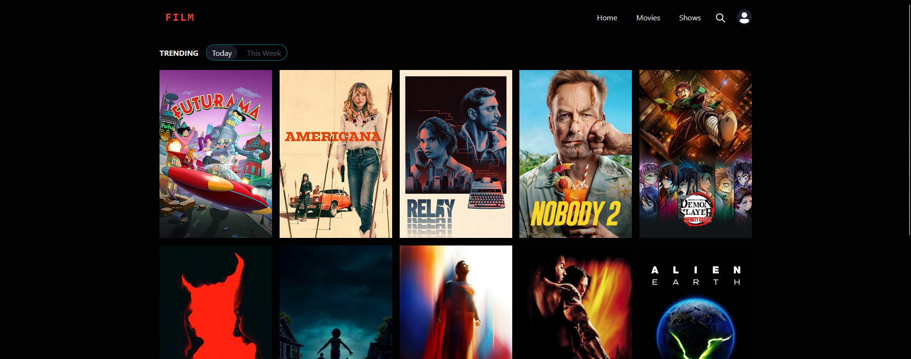

FILM é um projeto de plataforma para consulta e gerenciamento de filmes e séries, permitindo adicionar títulos à watchlist, visualizar detalhes e buscar conteúdos.

## Tecnologias Utilizadas

- **Frontend**

  - React.js
  - Chakra UI (componentes e estilos)
  - React Router (navegação)
  - Framer Motion (animações)
  - React Icons (ícones)

- **Backend / Serviços**

  - Firebase Authentication (login com Google)
  - Firebase Firestore (armazenamento de watchlist)
  - TMDB API

- **Outras Ferramentas**
  - Vite (bundler e desenvolvimento)
  - Axios

## Funcionalidades

- Login com Google
- Adicionar e remover itens da Watchlist
- Visualizar detalhes de filmes e séries
- Pesquisa de títulos
- Interface responsiva (desktop e mobile)
